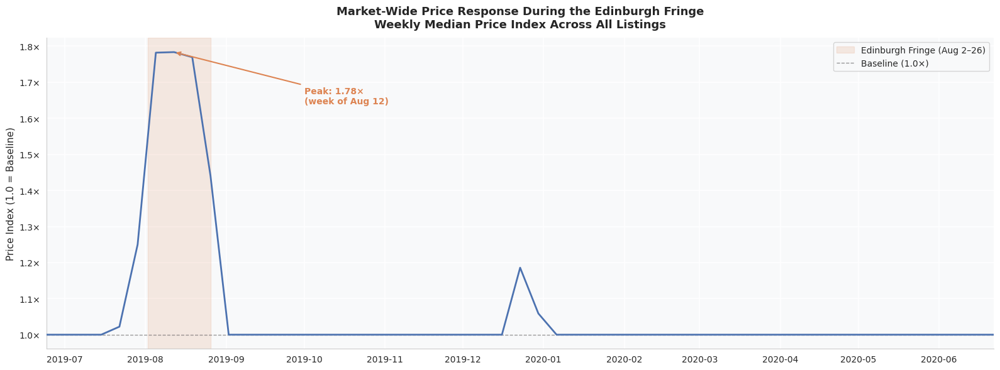
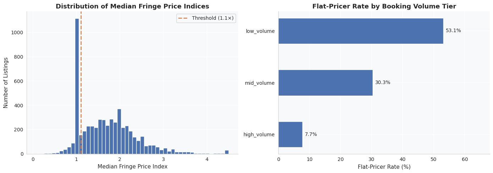
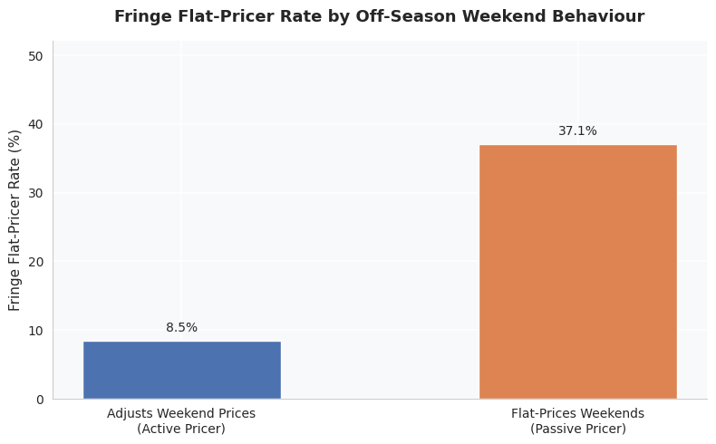
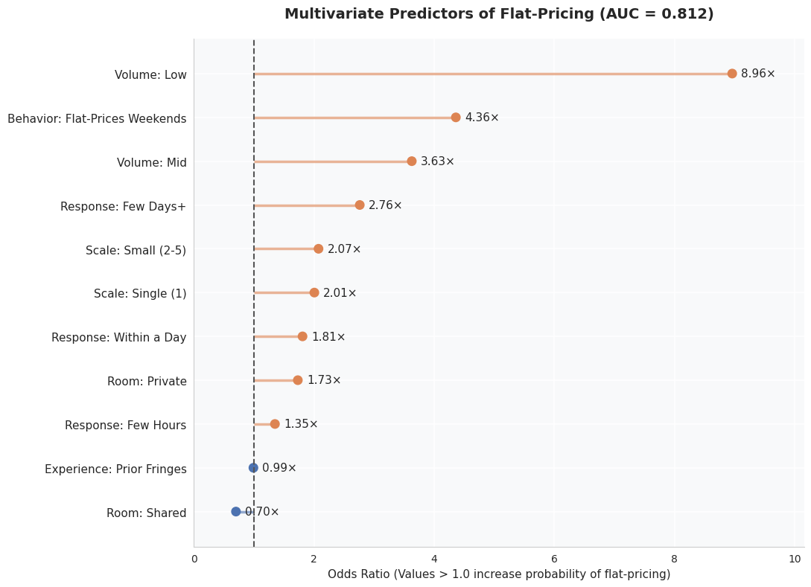

# Edinburgh Airbnb Pricing Behaviour During the 2019 Fringe Festival

Understanding how Airbnb hosts respond to predictable demand surges.

## Overview

Every August, the Edinburgh Festival Fringe creates one of the largest temporary accommodation demand spikes in the world.

This project analyzes Airbnb pricing behaviour during the 2019 Fringe Festival using listing-level pricing, availability, and review data from Inside Airbnb.

The objective was to understand how hosts responded to a predictable demand surge, identify listings that did not meaningfully adjust prices, and explore which observable host behaviours were associated with pricing responsiveness.

---

## Key Results

- Median listing prices increased to approximately **1.78× normal levels** during the Fringe Festival.
- Approximately **25% of listings remained near baseline pricing levels** during the event.
- Booking activity was more strongly associated with pricing responsiveness than host experience.
- Hosts who did not adjust prices during normal weekends were substantially more likely to remain near baseline pricing during the Fringe.
- Prior hosting experience showed little relationship with pricing behaviour.
- Flat-priced listings were associated with an estimated **£1.77M in unrealized host revenue** under the assumptions used in this analysis.

---

## Dataset

## Dataset 
**Source:**: [Inside Airbnb](http://insideairbnb.com/) — Edinburgh, scraped June 25, 2019 (via [Kaggle](https://www.kaggle.com/datasets/thoroc/edinburgh-inside-airbnb)) 

Files used:

- `listings.csv`
- `calendar.csv`
- `reviews.csv`

| Metric | Value |
|----------|----------|
| Listings | 13,191 |
| Calendar Records | 4.8M+ |
| Reviews | 528K+ |
| Analysis Period | Jun 2019 – Jun 2020 |
| Listings with Valid Price Baselines | 5,689 |

---

## Methodology

### Price Index Construction

To compare pricing behaviour across properties with very different price levels, a normalized Price Index was created:

```python
price_index = day_price / baseline_median_price
```

Where:

- `1.0×` = baseline pricing
- `1.5×` = 50% above baseline
- `2.0×` = double baseline pricing

Baseline prices were calculated using off-season periods outside the Fringe Festival.

### Booking Volume Segmentation

Review activity during the previous 12 months was used as a proxy for booking volume.

Listings were grouped into:

- Low Volume
- Mid Volume
- High Volume

### Flat-Pricer Definition

Listings were classified as flat-pricers if:

```python
median_fringe_price_index < 1.10
```

These listings increased prices by less than 10% relative to their baseline pricing during the festival period.

---

## Findings

### Market-Wide Demand Response



The Fringe Festival was associated with a clear market-wide pricing response.

Median listing prices peaked at approximately **1.78× baseline levels**, suggesting that hosts broadly recognized and responded to increased demand during the event.

---

### Flat-Pricers Represented a Meaningful Segment of the Market

Approximately **25.1% of listings** remained below the flat-pricer threshold during the Fringe period.

This suggests that a notable share of listings did not adjust prices to the same extent as the broader market.

---

### Booking Volume Was Strongly Associated with Pricing Behaviour



Low-volume listings were substantially more likely to remain flat-priced than highly active listings.

This relationship remained visible throughout the analysis and was one of the strongest observed behavioural patterns.

---

### Weekend Pricing Behaviour Was Informative



Listings that did not increase prices during normal off-season weekends were considerably more likely to remain flat-priced during the Fringe Festival.

This suggests that routine pricing behaviour may provide useful information about how hosts respond to major demand events.

---

### Host Experience Showed Limited Explanatory Power

Hosts with more years of prior Fringe experience did not appear substantially different from newer hosts in terms of pricing responsiveness.

This suggests that repeated exposure to the event alone may not be sufficient to improve pricing behaviour.

---

## Predictive Modeling

A Logistic Regression model was developed to identify factors associated with flat-pricing behaviour.

### Features

- Booking volume
- Weekend pricing behaviour
- Host response time
- Room type
- Prior Fringe experience

### Model Performance

| Metric | Value |
|----------|----------|
| AUC | 0.81 |

### Selected Predictors

| Variable | Odds Ratio |
|----------|----------|
| Low Booking Volume | 8.96× |
| Flat Weekend Pricing | 4.36× |
| Mid Booking Volume | 3.63× |
| Slow Response Time | 2.76× |



The model suggests that behavioural indicators were more informative than experience-related variables when identifying listings likely to remain flat-priced.

---

## Revenue Opportunity

Flat-priced listings were benchmarked against comparable listings within the same room type and neighbourhood.

| Metric | Value |
|----------|----------|
| Flat-Pricers Identified | 1,428 |
| Estimated Host Revenue Left on Table | £1.77M |
| Estimated Airbnb Commission Lost | £319K |

These estimates should be interpreted as scenario-based calculations rather than precise forecasts, as they depend on several simplifying assumptions.

---

## Assumptions

The analysis relies on several assumptions:

- Review count was used as a proxy for booking activity.
- Calendar availability was used as a proxy for occupancy.
- Baseline pricing windows were assumed to represent normal market conditions.
- Revenue opportunity estimates assume flat-priced listings could achieve peer-group pricing without a material reduction in occupancy.
- Peer-group pricing was defined using comparable listings within the same room type and neighbourhood.

---

## Limitations

Several limitations should be considered when interpreting the results:

- Not all guests leave reviews, so review counts are an imperfect measure of booking volume.
- Calendar availability cannot distinguish between booked nights and host-blocked nights.
- The analysis focuses on a single event in a single city and may not generalize to other markets.
- Revenue opportunity estimates do not explicitly model price elasticity or demand responses to higher prices.
- Some factors influencing host pricing decisions may not be captured in the available data.

While these limitations affect the precision of the estimates, they are less likely to change the broader behavioural patterns identified in the analysis.

---

## Conclusion

The Edinburgh Fringe Festival creates a substantial and predictable demand surge, yet a meaningful share of Airbnb listings remain close to baseline pricing throughout the event.

Across the variables examined, booking activity and routine pricing behaviour were more strongly associated with pricing responsiveness than host experience. These findings suggest that observable behavioural signals may be useful for identifying listings that are less likely to respond to major demand events.

More broadly, the analysis highlights how pricing behaviour can vary significantly across participants in the same marketplace, even when facing the same demand conditions.

---

## Tools

- Python
- Pandas
- NumPy
- Matplotlib
- Seaborn
- Scikit-Learn
- Jupyter Notebook

---

## Repository Structure

```text
edinburgh-airbnb-pricing-analysis/
│
├── data/
├── images/
│   ├── market_response.png
│   ├── flat_pricer_rate_by_volume.png
│   ├── weekend_pricing_signal.png
│   └── logistic_regression_odds_ratios.png
│
├── notebooks/
│   └── pricing_analysis.ipynb
│
├── README.md
├── requirements.txt
└── .gitignore
```
