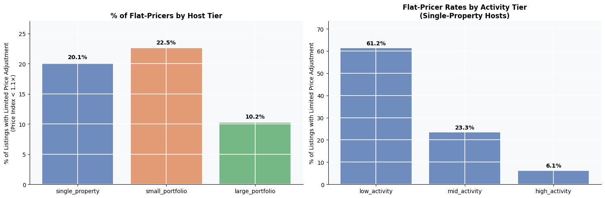
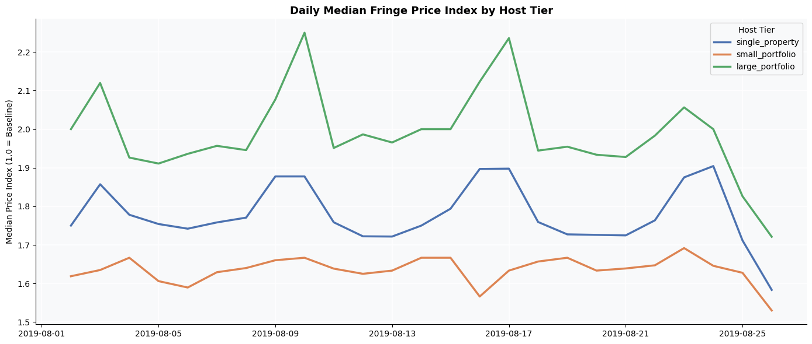

# Edinburgh Airbnb Pricing Analysis  
### How Airbnb Hosts Respond to Predictable Demand Shocks During the Fringe Festival

Every August, the Edinburgh Festival Fringe creates one of the largest temporary accommodation demand spikes in the world.  

This project analyzes how Airbnb hosts responded to that surge using listing-level pricing data from InsideAirbnb. The analysis focuses on a simple question:

> Which hosts successfully adjusted prices during peak demand — and which consistently underpriced despite a highly predictable market opportunity? 

---

## Project Overview

Using 4.8 million daily calendar observations from Airbnb listings in Edinburgh, this project examines pricing behavior during the 2019 Festival Fringe.

The analysis measures how different host segments reacted to the demand surge by comparing Fringe-period prices against each listing’s normal pricing baseline.

The project focuses on:

- Dynamic pricing behavior
- Marketplace inefficiency
- Host segmentation
- Revenue capture during predictable demand spikes

---

## Business Questions

This analysis investigates:

- Do all Airbnb hosts respond equally to predictable demand surges?
- Which host groups adjust prices most aggressively during the Fringe?
- Are smaller hosts systematically underpricing during peak demand?
- Does pricing responsiveness vary by operational sophistication and booking activity?
- Is the observed pricing gap driven by portfolio size, property mix, or behavioral differences?

---

## Dataset

**Source:**: [Inside Airbnb](http://insideairbnb.com/) — Edinburgh, scraped June 25, 2019 (via [Kaggle](https://www.kaggle.com/datasets/thoroc/edinburgh-inside-airbnb))

Datasets used:

- `listings.csv`
- `calendar.csv`
- `reviews.csv`

### Scale

| Metric | Value |
|---|---|
| Listings | 13,000+ |
| Daily calendar rows | 4.8M |
| Reviews analyzed | 528K |
| Time window | Jun 2019 – Jun 2020 |

---

## Methodology

### Pricing Normalization

To compare pricing behavior fairly across listings with very different base prices, the analysis constructs a normalized `price_index`:

```python
price_index = day_price / baseline_median_price
```

A value of:

- `1.0×` → normal pricing
- `1.5×` → 50% above baseline
- `2.0×` → double baseline pricing

Baseline prices were calculated using lower-demand periods outside the Fringe window.

---

### Host Segmentation

Hosts were grouped by portfolio size:

| Host Tier | Definition |
|---|---|
| Single-property | 1 listing |
| Small-portfolio | 2–5 listings |
| Large-portfolio | 6+ listings |

Booking activity tiers were also constructed using trailing 12-month review counts.

---

### Flat-Pricer Definition

A listing was classified as a **flat-pricer** if its median Fringe pricing remained close to baseline levels:

```python
median_fringe_price_index < 1.1
```

These listings showed limited pricing response despite the demand surge.

---

## Key Findings

### 1. The Fringe Creates a Strong Market-Wide Pricing Shock

Median Airbnb prices increased to nearly **1.8× baseline levels** during the festival period, confirming a large and highly predictable demand surge.

---

### 2. Large Portfolio Hosts Captured the Demand Premium Most Effectively

Hosts managing large portfolios consistently showed:

- higher Fringe price indices
- more aggressive pricing adjustments
- more frequent price updates during the festival

---

### 3. Small-Portfolio Hosts Showed the Weakest Pricing Response

Hosts managing **2–5 listings** had the highest concentration of flat-pricers in the market.

This pattern persisted even after controlling for:

- room type
- location
- weekday/weekend effects

---

### 4. Pricing Behavior Appears Linked to Operational Sophistication

Low-activity hosts were far more likely to leave prices near baseline levels during peak demand periods.

The findings suggest that marketplace inefficiency is driven not only by listing characteristics but also by differences in pricing strategy and operational behavior.

---

## Sample Visuals

### Market-Wide Price Response During the Fringe


---

### Flat-Pricer Rates by Host Tier



---

### Daily Fringe Pricing by Host Tier



---

## Tools Used

- Python
- Pandas
- NumPy
- Matplotlib
- Seaborn
- SciPy
- Jupyter Notebook

---

## Repository Structure

```text
edinburgh-airbnb-pricing-audit/
│
├── data/
├── images/
├── notebook/
│   └── airbnb_pricing_audit.ipynb
├── README.md
├── requirements.txt
└── .gitignore
```

---

## Why This Project Matters

Most Airbnb analyses focus on descriptive trends or pricing averages.  

This project instead examines **behavioral response to predictable demand shocks** — identifying which market participants capture pricing opportunities effectively and which systematically leave revenue unrealized.

The analysis combines marketplace economics, behavioral segmentation, and pricing analytics in a real-world platform setting.
